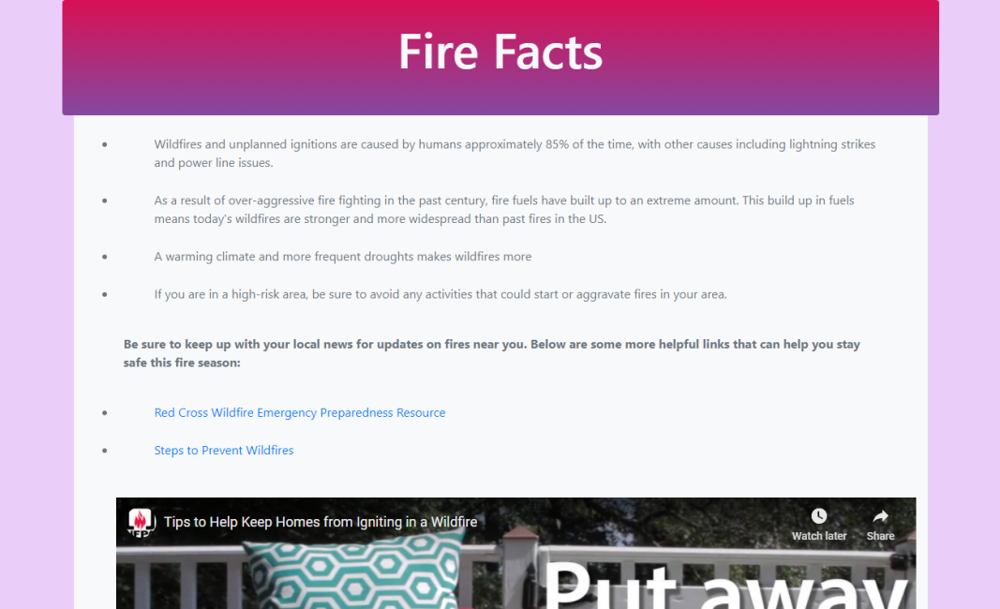
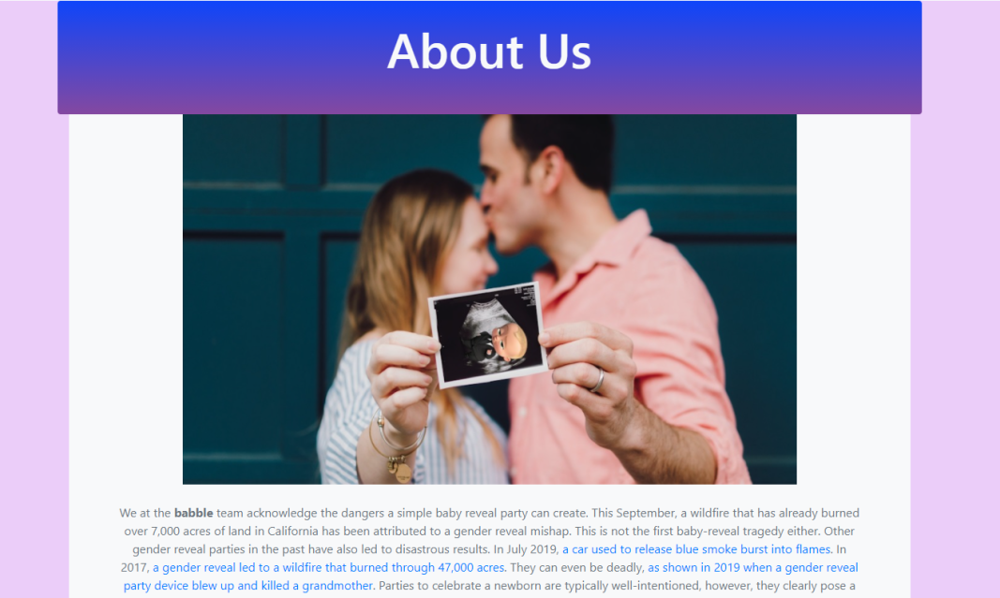

# PennAppsXXI
**Hackathon Project** (9/11/2020 - 9/13/2020). **Satirical** project aiming for **"Best Humor"** award.

Collaborated with **@melindali255** and **@Not John Cuviello** on this project.

# What is Babble?
**Babble** is a website application to host a baby gender reveal party virtually. In-person gender reveal parties have caused various disasters, with the latest wildfire in California stemming from a mishap from a party. We created babble to prevent these unfortunate events.

Using Babble, our users can create and host a party for their baby gender reveal party and invite their friends and family to celebrate with them. They can also learn more about the dangers of wildfires and help those who have been affected by the wildfire in California. 

# Screenshots
Here are some screenshots of our web application:

# Video Walkthrough

